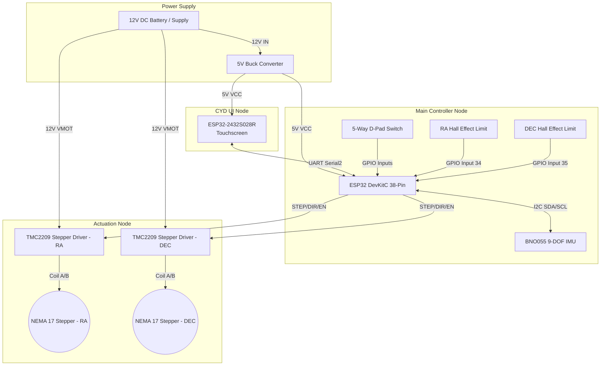

# DIY_startrackerGOTO: Hardware Architecture & Wiring Diagram

This document provides the high-level system block diagram, the detailed pinout wiring guide, and links to component datasheets.

## 1. System Block Diagram
*This diagram illustrates the primary data and power flow across the dual-MCU architecture.*

---

## 2. Circuit & Wiring Diagram (Pinout)

The system relies on an ESP32 (38-Pin DevKitC) acting as the main motor coordinator. 
*Note: Pins 34 and 35 are input-only and lack internal pull-up resistors. Ensure the Hall sensors have external 10kΩ pull-up resistors to 3.3V if they are open-drain.*

### ESP32 Main Board Connections

| Component | ESP32 Pin | Function / Signal Type | Notes |
| :--- | :--- | :--- | :--- |
| **CYD Display** | 16 | `CYD_RX` (Serial2 RX) | Connect to CYD TX |
| **CYD Display** | 17 | `CYD_TX` (Serial2 TX) | Connect to CYD RX |
| **TMC2209 (RA)** | 19 | `RA_EN` | Active LOW |
| **TMC2209 (RA)** | 18 | `RA_DIR` | Direction Control |
| **TMC2209 (RA)** | 5 | `RA_STEP` | Step Pulse |
| **TMC2209 (DEC)** | 14 | `DEC_EN` | Active LOW |
| **TMC2209 (DEC)** | 13 | `DEC_DIR` | Direction Control |
| **TMC2209 (DEC)** | 4 | `DEC_STEP` | Step Pulse |
| **BNO055 (IMU)** | 21 | `I2C_SDA` | I2C Data (Requires pull-ups) |
| **BNO055 (IMU)** | 22 | `I2C_SCL` | I2C Clock (Requires pull-ups) |
| **Hall Sensor (RA)** | 34 | `RA_HALL` | Input Only (Requires external 10k pull-up) |
| **Hall Sensor (DEC)**| 35 | `DEC_HALL` | Input Only (Requires external 10k pull-up) |
| **5-Way Switch** | 32 | `BTN_UP` | Internal Pull-up |
| **5-Way Switch** | 33 | `BTN_CENTER` | Internal Pull-up |
| **5-Way Switch** | 25 | `BTN_LEFT` | Internal Pull-up |
| **5-Way Switch** | 26 | `BTN_DOWN` | Internal Pull-up |
| **5-Way Switch** | 27 | `BTN_RIGHT` | Internal Pull-up |

### CYD (ESP32-2432S028R) Connections
The CYD board requires only power (5V/GND) and a UART crossover connection to the Main Board.
- **CYD TX (CN1 Pin)** → Connect to **ESP32 Pin 16 (RX)**
- **CYD RX (CN1 Pin)** → Connect to **ESP32 Pin 17 (TX)**
- **GND** → Common ground with Main Board

---

## 3. Component Datasheets & Reference Material

For deeper technical implementation or hardware debugging, refer to the official manufacturer datasheets below:

1. **Main Microcontroller:** ESP32-WROOM-32 
   - [ESP32 Datasheet (PDF)](https://www.espressif.com/sites/default/files/documentation/esp32_datasheet_en.pdf)
2. **Touchscreen Interface:** ESP32-2432S028R ("Cheap Yellow Display")
   - [CYD Hardware Repository & Schematics](https://github.com/witnessmenow/ESP32-Cheap-Yellow-Display)
3. **Stepper Motor Drivers:** Trinamic TMC2209 (Modules)
   - **Recommendation (OEM vs. BigTreeTech):** While generic OEM TMC2209 modules are widely available, **we highly recommend using the BigTreeTech (BTT) TMC2209 modules**. The BTT versions provide much more reliable documentation/datasheets, deliver more precise and stable current output (VREF tuning is more predictable), and are generally more "ready-to-use" out of the box without requiring extensive hardware hacking.
   - [Trinamic TMC2209 IC Datasheet (PDF)](https://www.trinamic.com/fileadmin/assets/Products/ICs_Documents/TMC2209_Datasheet_V103.pdf)
   - [BTT TMC2209 GitHub Repository & Manual](https://github.com/bigtreetech/BIGTREETECH-TMC2209-V1.2)
4. **9-DOF IMU Sensor:** Bosch BNO055
   - [BNO055 Datasheet (PDF)](https://www.bosch-sensortec.com/media/boschsensortec/downloads/datasheets/bst-bno055-ds000.pdf)
5. **Hall Effect Limits:** Typical A3144 or 49E (Depending on your exact BOM)
   - [A3144 Hall Effect Sensor (PDF)](https://www.allegromicro.com/~/media/Files/Datasheets/A3141-2-3-4-Datasheet.ashx)
